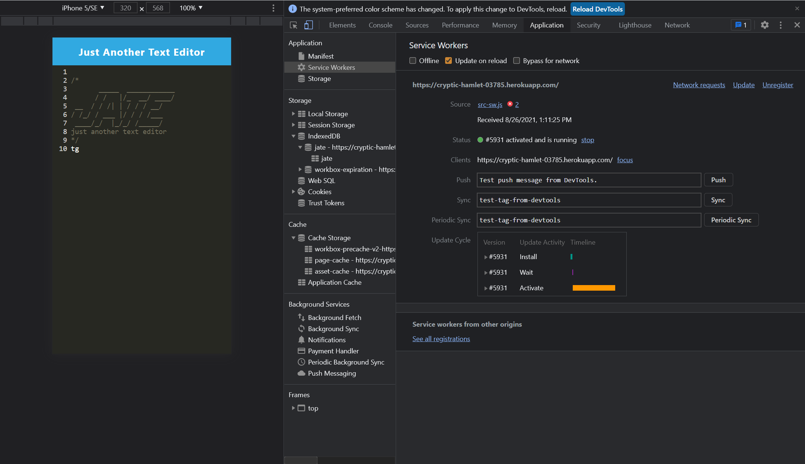

# Note the Code (Progressive Web Applications (PWA): Text Editor)

## PURPOSE

For the Web Developing enthusiast you may never know when a alternative option to the popular Visual Code may come in handy. This application can be pulled iff the bench if that days comes this application is a text editor that operates on a web browser that also functions offline. The package called `idb`, which is a lightweight wrapper around the IndexedDB API. It features a number of methods that are useful for storing and retrieving data, and is used by companies like Google and Mozilla.

## User Story

```md
AS A developer
YOU WANT to create notes or code snippets with or without an internet connection
SO THAT YOU can reliably retrieve them for later use
```

## Acceptance Criteria

```md
GIVEN a text editor web application
WHEN YOU open YOUR application in YOUR editor
THEN YOU should see a client server folder structure
WHEN YOU run `npm run start` from the root directory
THEN YOU find that YOUR application should start up the backend and serve the client
WHEN YOU run the text editor application from YOUR terminal
THEN YOU find that YOUR JavaScript files have been bundled using webpack
WHEN YOU run YOUR webpack plugins
THEN YOU find that YOU have a generated HTML file, service worker, and a manifest file
WHEN YOU use next-gen JavaScript in YOUR application
THEN YOU find that the text editor still functions in the browser without errors
WHEN YOU open the text editor
THEN YOU find that YOUR IndexedDB has immediately created a database storage
WHEN YOU enter content and subsequently click off of the DOM window
THEN YOU find that the content in the text editor has been saved with IndexedDB
WHEN YOU reopen the text editor after closing it
THEN YOU find that the content in the text editor has been retrieved from our IndexedDB
WHEN YOU click on the Install button
THEN YOU download YOUR web application as an icon on YOUR desktop
WHEN YOU load YOUR web application
THEN YOU should have a registered service worker using workbox
WHEN YOU register a service worker
THEN YOU should have YOUR static assets pre cached upon loading along with subsequent pages and static assets
WHEN YOU deploy to Render
THEN YOU should have proper build scripts for a webpack application
```
## Contributors 

```
Google, ChatGPT and Morzilla
```
### License

>Text

## Gif

The following animation demonstrates the application functionality:


The following image shows the application's `manifest.json` file:


The following image shows the application's registered service worker:



The following image shows the application's IndexedDB storage:


### Url

* The URL of the functional, deployed application:
* The URL of the GitHub repository: https://github.com/NewManuel/14-Note.the.Code
